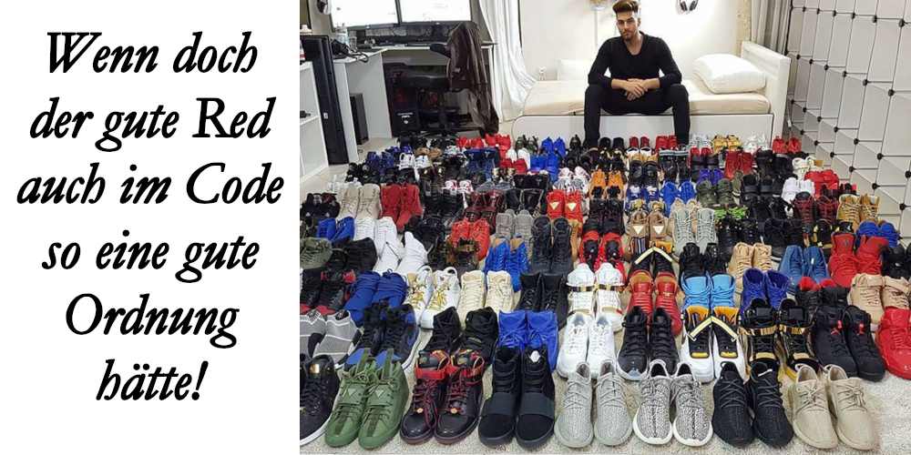
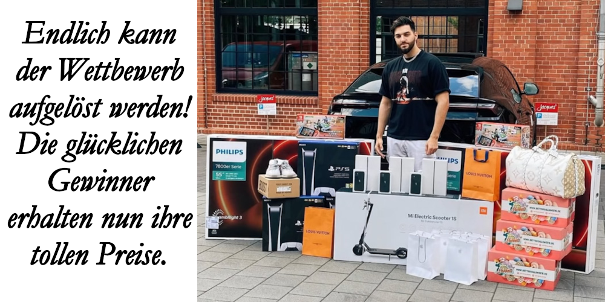
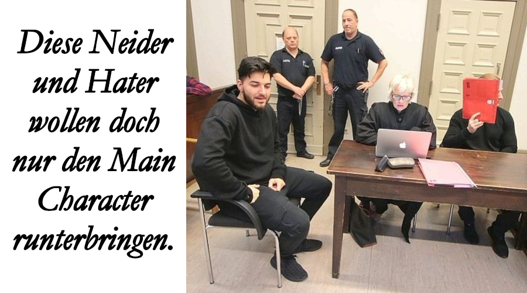

# Red Rigged Raffle

Erstellen Sie für die folgenden Aufgaben einen Fork von diesem Repository und klonen Sie diesen.

## Aufgabe 1: Bezeichner verbessern

Der Insolvenzverwalter möchte das Vermögen von ApoRed verwerten. Hierzu gehört
u.a. die Gewinnspiel-Software _Red Rigged Raffle_ der Software-Firma _Code Red_,
deren Daten auf MiiMiis Festplatte gefunden worden sind. Da Apo (das heisst Red!)
beim Programmieren selber Hand angelegt hat, ist der Code für Aussenstehende
etwas schwer verständlich.

Helfen Sie dem Insolvenzverwalter den Code zu verstehen, indem Sie die
Bezeichner sinnvoll umbenennen.

Sie können den Code über das Programm (`src/index.ts`) folgendermassen testen:

    npm install
    npm run build && npm run start

## Aufgabe 2: Code aufteilen

Die Gewinnspiel-Logik in `src/absneakender-hase.ts` besteht praktisch nur
aus einer grossen Methode – die nun hoffentlich nicht mehr `absneaken` heisst.
Versuchen Sie die verschiedenen Teile dieser Methode zu verstehen – und die
einzelnen Aspekte des Problems zu unterscheiden. (Stellen Sie sich die Frage,
aus welchen Teilproblemen das gesamte Problem besteht.)

Teilen Sie den Code auf, indem Sie die verschiedenen Aspekte der Methode in Untermethoden auslagern, welche Sie dann von der Hauptmethode aus aufrufen.

Führen Sie das Programm anschliessend testhalber erneut aus.

## Aufgabe 3: Fehlerkorrektur

Der Untersuchungsrichter hat Interesse für die Funktionsweise der
Gewinnspiel-Software _Red Rigged Raffle_ geäussert. Es steht der Verdacht im Raum,
dass diese Software nicht richtig funktioniere.

Schreiben Sie einen Unittest (siehe `src/testender-hase.test.ts`), um den
Verdacht des Untersuchungsrichter zu prüfen. (Tipp: Da das Ergebnis der
Verlosung zufällig ist, können Sie nicht auf exakte Werte prüfen, aber auf die
Anzahl verloster Preise.) Wichtig: Der Test sollte einen Fehler ergeben!

Führen Sie den Testfall folgendermassen aus:

    npm run test

Versuchen Sie den Fehler durch eine Analyse des Programmcodes nachzuvollziehen.
Korrigieren Sie anschliessend den Fehler, bis der Unittest erfolgreich
durchläuft.

## Zusatzaufgabe: Pull Request

Erstellen Sie einen Pull Request, falls Sie eine Rückmeldung zu Ihrer Arbeit wünschen.

**Herzliche Gratulation!** Dank Ihnen kann der Insolvenzverwalter nun die
verbleibenden Sachwerte von ApoRed an dessen Gläubiger verlosen; und der
Untersuchungsrichter kann dem _Main Character_ den Prozess machen.

### Zusatzaufgabe: Glossar

Vergleichen Sie beim Pull Request die ursprünglichen mit den von Ihnen gewählten
Bezeichnern. Erstellen Sie ein kleines Glossar _Red – Deutsch_ bzw. _Red –
Englisch_ aus den "übersetzten" Bezeichnern. (Sie können diese Tabelle bzw.
Liste mit dem Pull Request einreichen oder nachträglich ins Repository
aufnehmen.)
